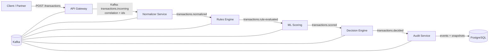
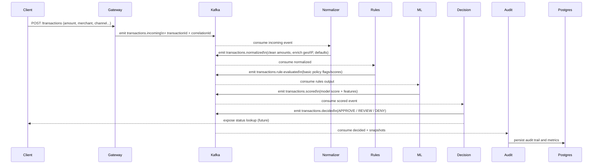

# Anti-fraud SEDA

## Intention
- Event-driven anti-fraud pipeline built with NestJS microservices and Kafka to validate payment transactions before capture.
- Kafka carries transaction events through Normalizer, Rules Engine, ML Scoring, and Decision services so each stage can evolve independently.
- API Gateway accepts `/transactions`, validates client payloads, and enriches requests with `transactionId` and `correlationId` for observability.
- Postgres is planned for the Audit Service to persist the full decision trail and support compliance or analytics queries.

## Microservices diagram

## Workflow diagram

## Progress list
- [x] API Gateway: HTTP endpoint `/transactions` validates payload and emits `transactions.incoming` with correlation and transaction IDs.
- [ ] Normalizer Service: consume incoming events and standardize/enrich transaction payloads.
- [ ] Rules Engine Service: apply deterministic business rules and flag violations.
- [ ] ML Scoring Service: generate fraud risk score from engineered features.
- [ ] Decision Engine Service: merge rules + ML to produce final decision and expose status queries.
- [ ] Audit Service: persist events/decisions to Postgres and expose an audit/activity feed.
- [ ] Observability & CI: logging/metrics per stage plus automated tests.
- [ ] Local DX: docker-compose wiring, seeded Kafka topics, and sample client scripts.
